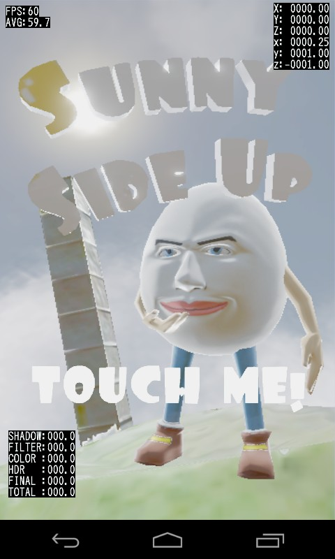
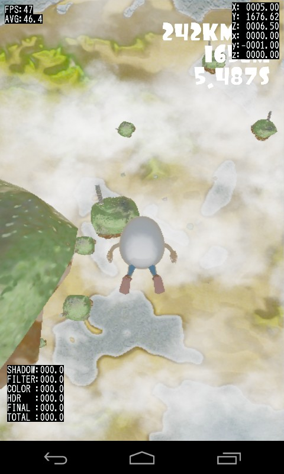
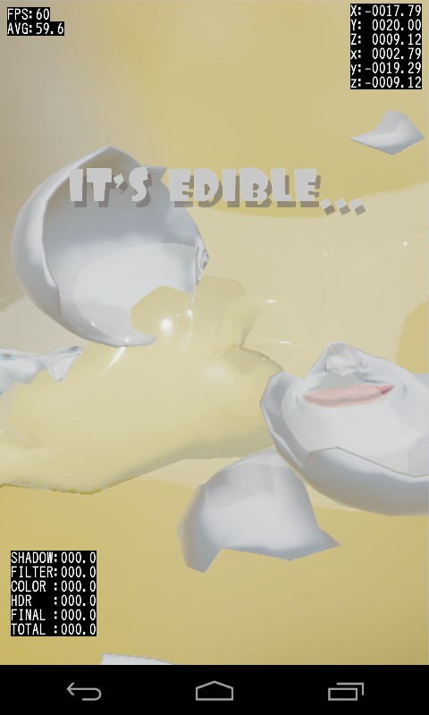

# NDKOpenGLES2App
This project is my practice for NDK and OpenGL ES 2.0.
It is for Android.
But for testing, it can execute on Windows using Google Angle.
It include audio support by OpenSL ES for Android.

